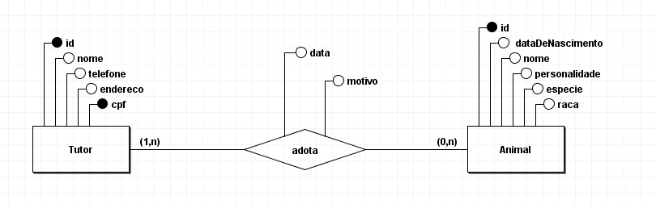

# Atividade Qualitativa DAC 2024.1 - Adoção de Animais

## Grupo
- [Gabriella Braga](https://github.com/gabs44)
- [Maria Clara](https://github.com/marysclair)

## Sobre o projeto
Atividade qualitativa sobre JDBC desenvolvida para a disciplina DAC 2024.1, com o tema 10: Adoção de Animais.

## Diagrama relacional


## Scripts para criar as tabelas no banco
```sql
CREATE TABLE tutor (
    id SERIAL PRIMARY KEY,
    nome VARCHAR(50) NOT NULL,
    telefone VARCHAR(14) NOT NULL,
    endereco VARCHAR(50) NOT NULL,
    cpf VARCHAR(11) NOT NULL UNIQUE
);

CREATE TABLE animal (
    id SERIAL PRIMARY KEY,
    datanascimento Date,
    nome VARCHAR(20) NOT NULL,
    personalidade VARCHAR(50) NOT NULL,
    especie VARCHAR(20) NOT NULL,
    raca VARCHAR(20)
);

CREATE TABLE adocao (
    id SERIAL PRIMARY KEY,
    idTutor INT NOT NULL,
    idAnimal INT NOT NULL,
    data Date NOT NULL,
    motivo VARCHAR(100) NOT NULL,
    FOREIGN KEY (idTutor) REFERENCES tutor(id),
    FOREIGN KEY (idAnimal) REFERENCES animal(id)
);
